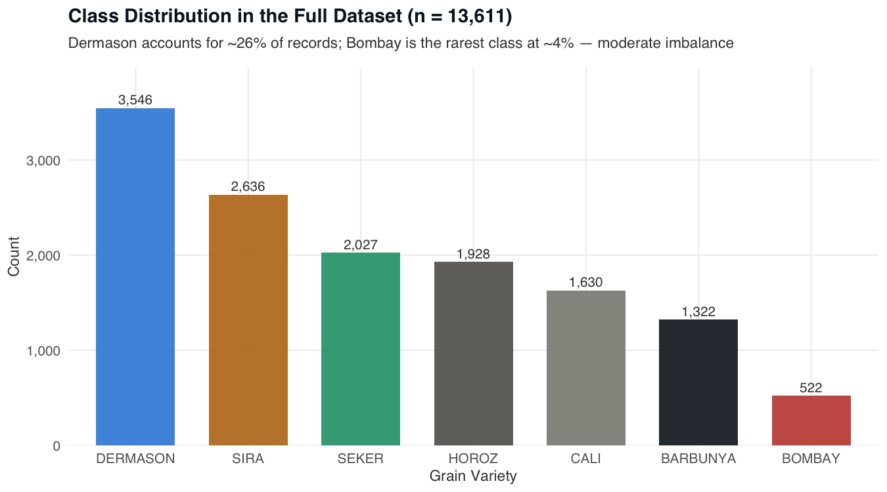
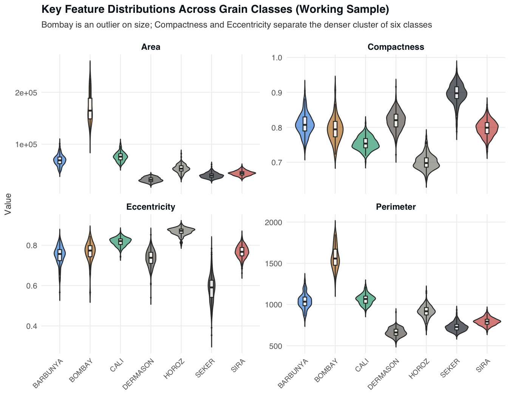
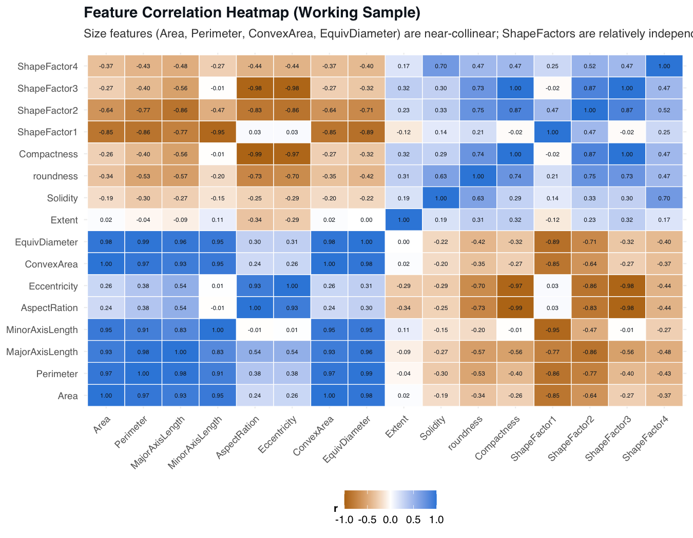
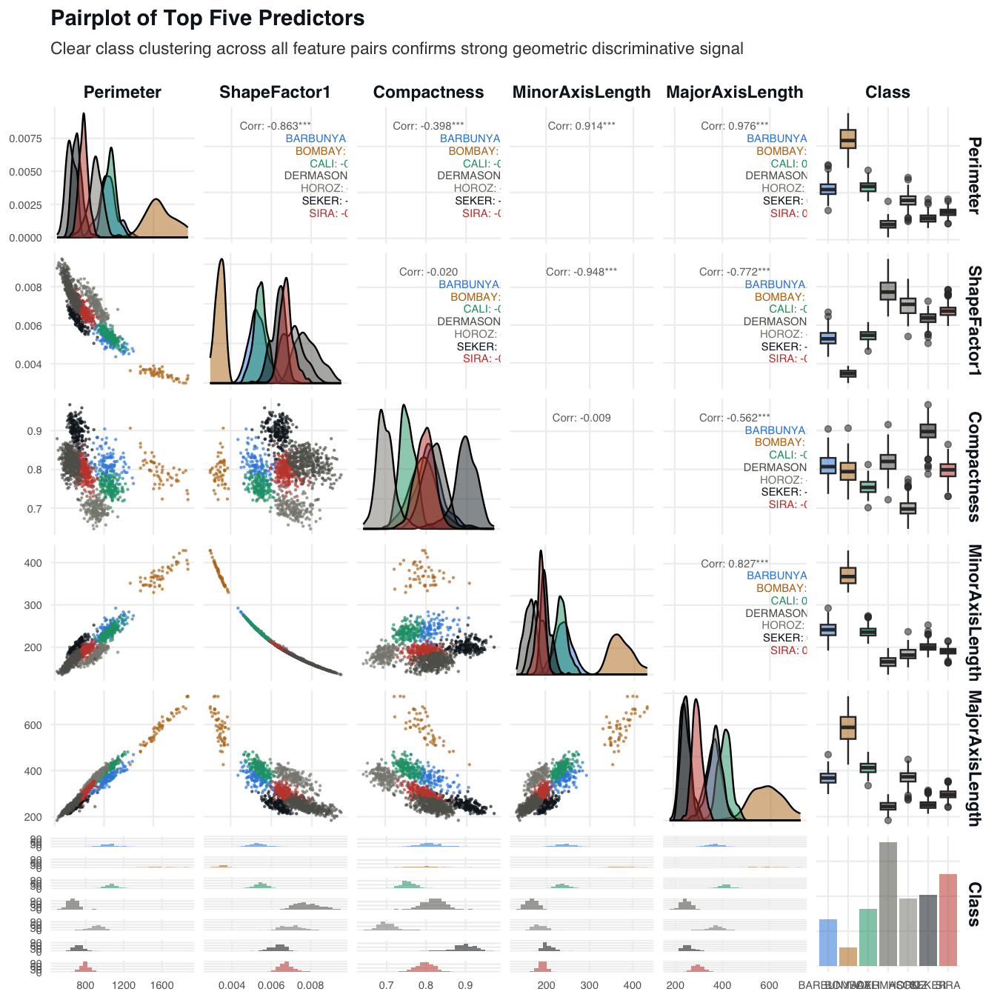
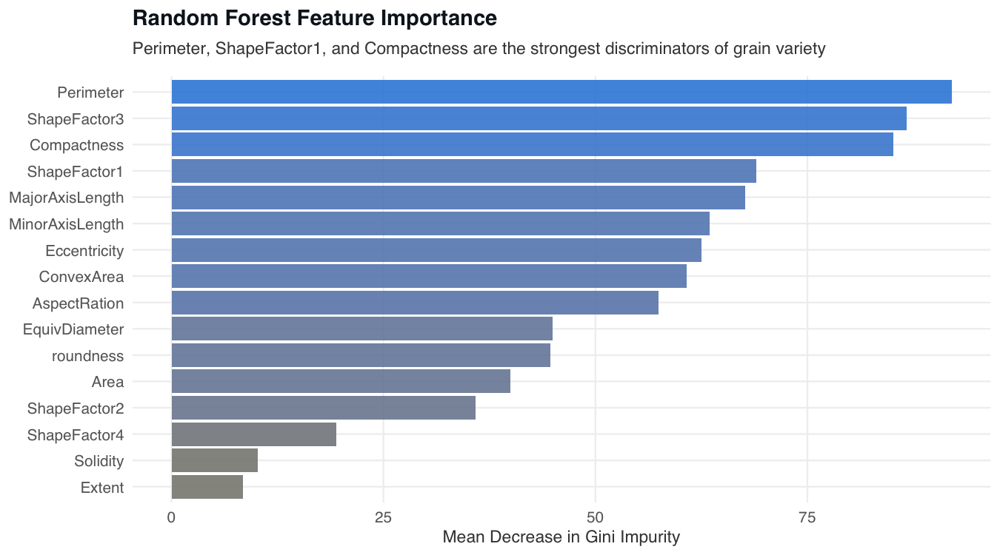

# 📌 AgriGrain: Grain Type Classification

> Five supervised classifiers benchmarked on 16 geometric shape features to automate identification of seven dry bean grain varieties.

## 📖 Overview
 - Implements a multiclass classification pipeline that identifies seven dry bean varieties — Barbunya, Bombay, Cali, Dermason, Horoz, Seker, and Sira — from 16 continuous geometric shape features extracted from digital grain images.
 - Benchmarks five algorithm families with fundamentally different inductive biases: Bagging, Random Forests, Gradient Boosting (GBM), Mixture Discriminant Analysis (MDA), and Artificial Neural Networks (ANN).
 - Built entirely in R as a self-contained R Markdown document; all modelling, EDA, and figure generation execute in a single `rmarkdown::render()` call, with `renv` ensuring a reproducible package environment.
 - A stratified 10% subsample (n = 1,364) of the UCI Dry Bean Dataset (n = 13,611) is used throughout, preserving class proportions while keeping computation tractable; tree-based methods use raw features while MDA and ANN operate on a column-standardised copy.

## 🏢 Business Impact
Manual grain inspection is slow, inconsistent, and cannot scale to modern agricultural processing volumes. This project demonstrates that a computer-vision pipeline — measuring shape geometry from grain images — combined with a tuned ensemble classifier can automate variety identification at 91.1% accuracy across seven classes, with all five tested algorithms performing within 1.5% of each other. A production deployment based on these results would reduce manual sorting labour, eliminate inter-operator inconsistency, and provide a probabilistic output (via MDA or ANN) that downstream quality-control systems can act on without human intervention.

## 🚀 Features
✅ **Five-Algorithm Benchmark:** Evaluates Bagging, Random Forests, GBM, MDA, and ANN under identical train/test conditions, enabling a direct, apples-to-apples comparison across inductive biases.  
✅ **5-Fold Cross-Validated Hyperparameter Tuning:** All five models are tuned via grid search over CV folds — ntree and mtry for tree ensembles, n.trees/depth/λ for GBM, size and decay for ANN — ensuring fair comparisons rather than default-parameter baselines.  
✅ **Stratified Subsampling and Splits:** Both the 10% working sample and the 75/25 train/test split are drawn with `createDataPartition()` to preserve the original class proportions, preventing minority-class underrepresentation that would inflate accuracy estimates.  
✅ **Comprehensive Exploratory Data Analysis:** Five publication-quality figures — class balance, feature distributions by class, correlation heatmap, top-feature pairplot, and Random Forest feature importance — document the structure of the data before any modelling begins.  
✅ **Feature Importance Analysis:** Random Forest Mean Decrease in Gini identifies Perimeter, ShapeFactor1, Compactness, MinorAxisLength, and MajorAxisLength as the five strongest discriminators, aligning with domain knowledge about grain size and shape regularity.  
✅ **Fully Reproducible Report:** `set.seed(42)` is applied at every stochastic step; `renv::restore()` locks the package environment; the entire analysis renders from a single `.Rmd` file with no manual steps.  

## ⚙️ Tech Stack
| Technology                  | Purpose                                                              |
| --------------------------- | -------------------------------------------------------------------- |
| `R`                         | Primary language for all data processing, modelling, and reporting   |
| `rmarkdown`                 | Renders the end-to-end analysis notebook to HTML                     |
| `renv`                      | Locks the R package environment for cross-machine reproducibility    |
| `randomForest`              | Implements both Bagging (mtry = p) and Random Forests (mtry = 6)    |
| `gbm`                       | Multinomial Gradient Boosting with shrinkage and depth regularisation|
| `mclust`                    | Mixture Discriminant Analysis via BIC-selected Gaussian mixtures     |
| `nnet`                      | Single-hidden-layer ANN with softmax output and weight decay         |
| `caret`                     | Unified 5-fold CV grid search for hyperparameter tuning              |
| `e1071`                     | `tune()` wrappers used for RF and ANN hyperparameter search          |
| `ggplot2`                   | All five EDA and results figures                                     |
| `GGally`                    | Pairplot (`ggpairs`) of the top five predictors                      |
| `dplyr` / `tidyr`           | Data wrangling and reshaping for EDA pipelines                       |
| `reshape2`                  | Melts the correlation matrix for the heatmap                         |

## 📂 Project Structure
<pre>
📦 AgriGrain - Grain Type Classification
 ┣ 📂 data
 ┃ ┗ 📂 raw
 ┃   ┣ 📜 DB.csv
 ┃   ┗ 📜 README.md
 ┣ 📂 figures
 ┃ ┣ 📜 01_class-balance.png
 ┃ ┣ 📜 02_feature-distributions.png
 ┃ ┣ 📜 03_correlation-heatmap.png
 ┃ ┣ 📜 04_pairplot.png
 ┃ ┗ 📜 05_feature-importance.png
 ┣ 📂 results
 ┃ ┗ 📜 metrics.md
 ┣ 📜 analysis.Rmd
 ┣ 📜 LICENSE
 ┗ 📜 README.md
</pre>

> **Why a separate scaled dataset (`xda2`)?** Tree-based methods (Bagging, RF, GBM) are invariant to feature scale and use the raw working sample directly. MDA and ANN require features on a common scale to satisfy their distributional and optimisation assumptions, so `xda2` holds a column-standardised copy used exclusively by those two models — avoiding any risk of inadvertently applying scaling to tree-based training runs.

## 🛠️ Installation

1️⃣ **Clone the repository**
<pre>
git clone https://github.com/real-ahmed-moussa/AgriGrain.git
cd AgriGrain
</pre>

2️⃣ **Download the dataset**
<pre>
# 1. Download Dry_Bean_Dataset.xlsx from:
#    https://archive.ics.uci.edu/dataset/602/dry+bean+dataset
# 2. Export the data sheet as CSV
# 3. Rename to DB.csv and place it at:
data/raw/DB.csv
</pre>

3️⃣ **Restore the R package environment**
<pre>
install.packages("renv")
renv::restore()
</pre>

4️⃣ **Render the full analysis**
<pre>
rmarkdown::render("analysis.Rmd")
</pre>

> The rendered HTML report is written to the project root. All figures are written to `figures/` and all model metrics are written to `results/metrics.md` as side effects of the render.

## 📂 Analysis Figures

### Class Distribution

  

### Feature Distributions by Class

  

### Correlation Heatmap

  

### Top-Feature Pairplot

  

### Random Forest Feature Importance

  

## 📊 Results
 - **Task:** Seven-class grain variety identification from 16 geometric shape features (UCI Dry Bean Dataset, n = 1,364 stratified working sample, 75/25 train/test split).
 - **Best accuracy:** Random Forest and ANN jointly achieved 91.1% test accuracy (8.9% misclassification); Random Forest is the preferred model with the highest Adjusted Rand Index at 0.785.
 - **Performance spread:** All five algorithms fell within a 1.5% window (90.5%–91.1%), confirming that the geometric features — not the choice of algorithm — are the primary driver of classification quality.
 - **Boosting generalisation gap:** GBM achieved 0.2% training misclassification but 9.5% test misclassification — the largest train–test gap among all models — indicating that sequential residual fitting over-adapts at this sample size despite shrinkage (λ = 0.05) and shallow trees (depth = 3).
 - **Top predictors:** Perimeter, ShapeFactor1, Compactness, MinorAxisLength, and MajorAxisLength account for the majority of discriminative signal; the four collinear size features (Area, Perimeter, ConvexArea, EquivDiameter) jointly capture one dominant axis of variation.

## 📝 License
This project is shared for portfolio purposes only and may not be used for commercial purposes without permission.
